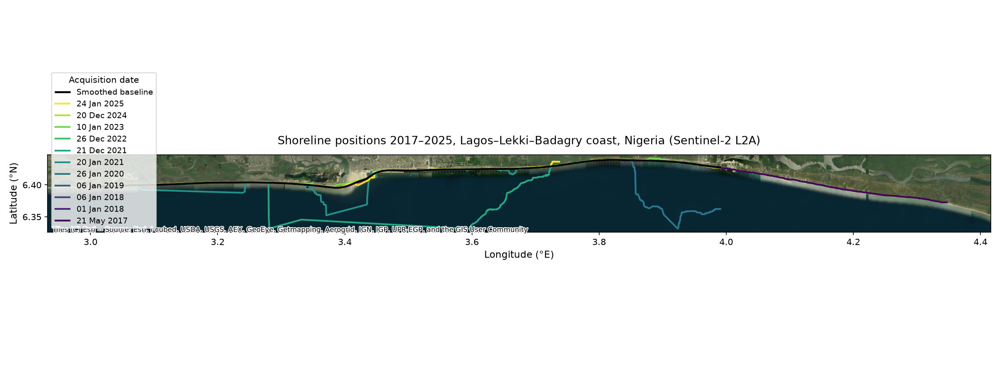
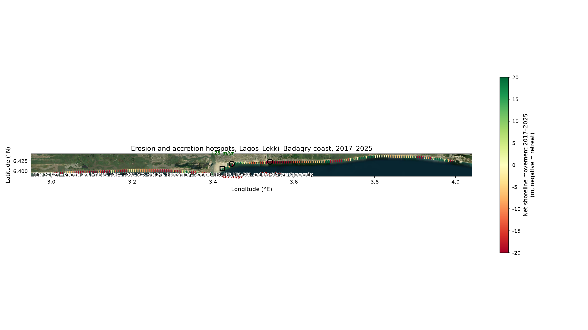
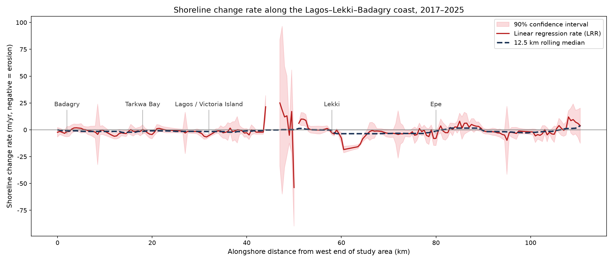

# Shoreline Change on the Lagos–Lekki–Badagry Coast, Nigeria (2017–2025)

A fully open, reproducible **DSAS-style shoreline change analysis** implemented entirely in Python. Eleven cloud-free Sentinel-2 scenes are classified into water and land with the Modified Normalised Difference Water Index and Otsu thresholding; the shoreline of each scene is recovered as a polyline; a baseline and 500 m perpendicular transects are constructed; and End Point Rates, Linear Regression Rates and Weighted Linear Regression Rates are computed per transect, with uncertainties.

Author: Tunde Akinlade ([Akin-Tunde](https://github.com/Akin-Tunde)) · Marine science graduate (B.Tech, Federal University of Technology Akure) · Licensed under the [MIT License](LICENSE).

---

## 1 · Results at a glance

**Multi-year shoreline positions.** Every extracted shoreline (2017–2025) overlaid on a satellite basemap, colour-coded by acquisition date. The smoothed black line is the median-position baseline.



**Erosion and accretion hotspots.** The colour scale shows net shoreline movement between the earliest and latest scene at each transect anchor point. The strongest erosion occurs at the Lagos harbour entrance (−54 m/yr at transect 96); the strongest accretion occurs at the Tarkwa Bay sand spit (+25 m/yr at transect 90).



**Alongshore rate profile.** Linear Regression Rate (red, with 90 % confidence interval) and the 12.5 km rolling median (blue dashed) along the 110.6 km study baseline. Negative values denote erosion.



| Statistic (per transect) | Value |
|---|---|
| Transects analysed | 218 (500 m spacing over 110.6 km) |
| Scenes used | 11 clear Sentinel-2 L2A scenes, 2017-05-21 → 2025-01-24 |
| Median Linear Regression Rate | −1.54 m/yr |
| Mean Linear Regression Rate | −1.47 m/yr (mean SE ±3.6 m/yr) |
| Mean End Point Rate | −0.74 m/yr |
| Mean Weighted Linear Regression Rate | −1.74 m/yr |
| Eroding (< −0.5 m/yr) | 146 transects (67 %) |
| Stable (±0.5 m/yr) | 25 transects |
| Accreting (> +0.5 m/yr) | 47 transects (22 %) |
| Strongest erosion hotspot | −53.8 m/yr at transect 96 (Lagos harbour mouth) |
| Strongest accretion hotspot | +25.0 m/yr at transect 90 (Tarkwa Bay spit) |

All numbers in this table are computed directly from `data/shoreline_rates.csv` by the pipeline in `scripts/`; nothing is taken from external sources.

## 2 · What this study measures, and why it matters

The Lagos–Lekki–Badagry coast is a **barrier-lagoon system**: a narrow sand strip, mostly 200–800 m wide, separates the Atlantic Ocean from the Lagos Lagoon complex. Behind it live more than twenty million people in Lagos, the most populous city in Africa. The strip is attacked from both sides — ocean waves from the south and lagoon currents from the north — and its retreat destroys beaches, houses, roads and the coastal tourism economy.

Published work consistently places this coast among the fastest-eroding coastlines in West Africa: Osanyintuyi et al. (2022) report that roughly 90 % of the Lagos barrier coast retreated at a mean of −3.55 m/yr between 1973 and 2019 [1], other Lagos studies document retreats of 8–14 m/yr in vulnerable sections [3] and local maxima near −18 m/yr [2]. This repository reproduces that kind of evidence from scratch: free imagery, free software, no proprietary tools — a pipeline that any Nigerian coastal researcher can run on their own laptop.

Our decade-long snapshot reproduces the published pattern: **the coast is, on balance, retreating (median −1.5 m/yr), with the eroding signal concentrated around the Lagos harbour** (the single strongest retreat is −53.8 m/yr at the harbour mouth, and a consistent belt of −16 to −18 m/yr runs along transects 121–127 east of the entrance). Immediately updrift, **the Tarkwa Bay sand spit (transects 88–99) accretes at +12 to +25 m/yr**, which is the sedimentary signature of the harbour jetties acting as a cross-shore and alongshore barrier.

## 3 · Methodology

The workflow follows the conventions of the USGS Digital Shoreline Analysis System (DSAS v5.0) [4], reimplemented in Python with `rasterio`, `shapely`, `geopandas` and `scipy`.

1. **Scene selection.** The Copernicus Data Space Ecosystem STAC API [5] is searched for Sentinel-2 Level-2A scenes over the study area `(2.9°–4.35°E, 6.15°–6.85°N)` with scene-level cloud cover ≤ 15 %. The two clearest scenes per year are kept and verified against the public Sentinel-2 archive on AWS [6] before download.
2. **Water/land classification.** For each scene we compute the **Modified NDWI** of Xu (2006) [7],
   `MNDWI = (ρ_green − ρ_SWIR1) / (ρ_green + ρ_SWIR1)`,
   which outperforms the original NDWI of McFeeters (1996) [8] over sandy coasts because SWIR suppresses the response of beach sand, built-up areas and vegetation. Clouds, cloud shadow, cirrus and nodata are removed with the Sentinel-2 SCL quality layer. An **Otsu threshold** [9] — recomputed per scene — splits the clear-pixel histogram into water and land, followed by morphological opening/closing to remove salt-and-pepper noise.
3. **Shoreline extraction.** The Atlantic Ocean is the largest connected water component and reaches the southern edge of every crop window. In each image column that genuinely crosses the beach, the shoreline is the bottom edge of the land class. Columns belonging to inlets, lagoon fingers or artefacts are rejected by a two-stage robust median filter applied along the track; surviving points are Douglas–Peucker simplified and reprojected to WGS84.
4. **Baseline and transects.** The **baseline** is the median shoreline position across all eleven scenes, smoothed with a Savitzky–Golay filter and offset 100 m landward. **222 transects** are cast perpendicular to it at 500 m spacing, each 600 m long. Transect–shoreline intersections give a position time series per transect (distance from the land end, in metres).
5. **Rate statistics.** Per transect we compute: **EPR** (net displacement ÷ elapsed years), **LRR** (slope of OLS position-versus-time regression, with standard error and 90 % confidence limits), and **WLR** (inverse-cloud-cover weighted regression). Each transect is classified as eroding (< −0.5 m/yr), stable (±0.5 m/yr) or accreting (> +0.5 m/yr).

The full pipeline is split into four notebooks under `notebooks/` mirroring the four scripts in `scripts/`.

## 4 · Data

| Item | Source | Licence / cost |
|---|---|---|
| Imagery | Sentinel-2 MSI Level-2A, tiles 31NEH / 31NFH | ESA Copernicus, free & open |
| Scene catalogue | Copernicus Data Space Ecosystem STAC API [5] | Free, no account needed to search |
| Raster download | Public AWS Sentinel-2 L2A archive [6] | Free, anonymous S3 access |
| Basemaps in figures | Esri World Imagery via contextily | Free for display |
| Reference methodology | USGS DSAS v5.0 [4] | Free software |

The exact scene list, with tile, date and cloud cover, is in `data/scene_catalog.json`; all derived products (shorelines, distances, rates) live in `data/` as GeoJSON and CSV.

## 5 · Limitations

This is a research demonstration, not a survey product, and the following constraints should be kept in mind.

* **Demonstration period.** The public Sentinel-2 L2A mirror for this region stores scenes only from 2017 onward, so the demonstrable decade is 2017–2025 rather than the planned 2015–2025; two of the target years (2025 winter, and one 2017 scene) had no suitable tile available and the final catalogues contain one scene in those years.
* **Positional uncertainty.** At 10–20 m pixel size the shoreline position is uncertain by roughly one to two pixels, plus the Sentinel-2 geolocation uncertainty of about 10–12 m (90 % CEP); following Moore (2000) the combined uncertainty is commonly quoted as ≈ 1.5 × ground-sample distance [10], i.e. ≈ 15–30 m. Rates computed over only ~8 years of such data carry large standard errors (mean LSE ±3.6 m/yr).
* **Tide and wave bias.** Shorelines are extracted from single overpasses near local noon. Water level differs between dates by up to the local tidal range (~1.5–2 m) and wave setup, which moves the extracted line tens of metres even without real change. No tidal correction was applied.
* **Lagoon-side complexity.** Around the Lagos harbour mouth, the inlet channels and the Five Cowrie Creek make the "beach" ambiguous at 20 m resolution; the hotspot rates there (−54 to +25 m/yr) are indicative rather than survey-grade.
* **Scene availability.** Several winter scenes failed quality control (haze misclassification produced spurious ocean loops) and were dropped; per-year coverage is therefore one or two scenes, not a full seasonal record.

## 6 · How to run

```bash
git clone https://github.com/Akin-Tunde/shoreline-nigeria.git
cd shoreline-nigeria
python3 -m venv .venv && source .venv/bin/activate
pip install -r requirements.txt
PYTHONPATH=. python3 scripts/03_extract_shorelines.py   # shoreline extraction
PYTHONPATH=. python3 scripts/04_baseline_transects.py   # baseline + transects
PYTHONPATH=. python3 scripts/05_compute_rates.py        # EPR / LRR / WLR
PYTHONPATH=. python3 scripts/06_make_figures.py         # publication figures
```

Everything above this line runs offline against the imagery already downloaded in `data/raw/` (≈ 3 GB). The Jupyter notebooks in `notebooks/` document the same steps with explanations for academic readers.

## 7 · Provenance

The analytical approach extends the author's final-year project at the Federal University of Technology Akure (grade 72A). All figures and statistics in this README are produced by the code in this repository from the data it downloads; no numbers have been copied from external sources.

## References

[1]: https://www.sciencedirect.com/science/article/pii/S1464343X22001807 "Osanyintuyi et al. (2022). Nearly five decades of changing shoreline mobility along the densely developed Lagos barrier-lagoon coast of Nigeria. Journal of African Earth Sciences."
[2]: https://link.springer.com/article/10.1007/S41976-021-00059-W "Assessment of shoreline change along the coast of Lagos, Nigeria. Arabian Journal of Geosciences (2021)."
[3]: https://www.researchgate.net/publication/334725981_Coastal_Erosion_and_Tourism_Infrastructure_in_Lagos_State "Coastal Erosion and Tourism Infrastructure in Lagos State, Nigeria."
[4]: https://doi.org/10.3133/ofr20181179 "Himmelstoss et al. (2018). Digital Shoreline Analysis System (DSAS) version 5.0 user guide. USGS Open-File Report 2018-1179."
[5]: https://dataspace.copernicus.eu/ "Copernicus Data Space Ecosystem — STAC API catalogue."
[6]: https://registry.opendata.aws/sentinel-2-l2a/ "AWS Open Data — Sentinel-2 Level-2A archive."
[7]: https://doi.org/10.1080/01431160600589179 "Xu, H. (2006). Modification of normalised difference water index (NDWI) to enhance open water features in remotely sensed imagery. IJRS."
[8]: https://doi.org/10.1080/01431169608948714 "McFeeters, S.K. (1996). The use of the Normalised Difference Water Index (NDWI) in the delineation of open water features. IJRS."
[9]: https://doi.org/10.1109/TSMC.1979.4310076 "Otsu, N. (1979). A threshold selection method from gray-level histograms. IEEE Trans. Systems, Man and Cybernetics."
[10]: https://doi.org/10.1016/S0309-1708(99)00055-0 "Moore, L.J. (2000). Shoreline mapping techniques. Journal of Coastal Research."
